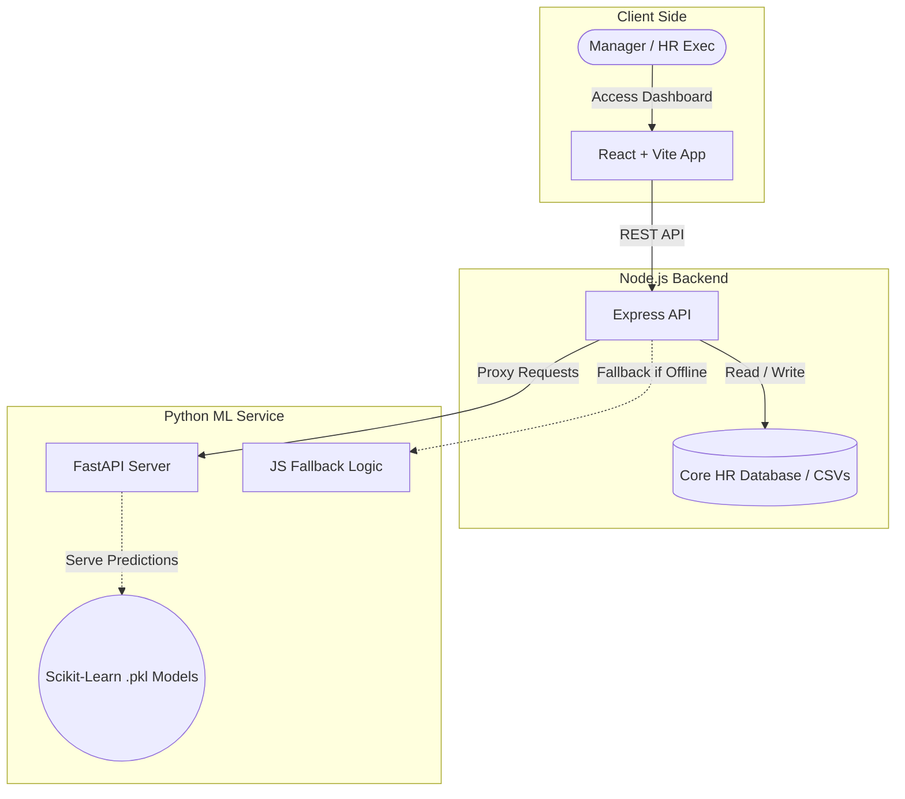

# 🧠 Humetrics: AI-Driven Workforce Intelligence

[](https://reactjs.org/)
[](https://nodejs.org/)
[](https://fastapi.tiangolo.com/)

**Humetrics** is a cutting-edge HR Analytics and Workforce Management platform designed to transform raw human resources data into actionable, predictive intelligence. By integrating real Scikit-learn machine learning models via a dedicated Python microservice, a robust Node.js backend proxy, and a beautiful, high-performance React frontend, Humetrics empowers HR professionals and business leaders to foresee attrition, detect behavioral risks, ensure pay equity, and strategically plan for workforce training and promotions.

Stop reacting to HR challenges. Start predicting them.

---

## ✨ Key Features

- 🔮 **Predictive Attrition & Retention**: Identify which employees are most likely to leave and understand the underlying drivers.
- ⚖️ **Pay Equity Analysis**: Automatically detect systemic compensation imbalances across gender, roles, and departments to ensure fair pay using Gradient Boosting Regressors.
- 🎯 **Performance Forecasting**: Leverage historical data to predict employee success trajectories and optimize role matching using Random Forest models, strictly based on true behavioral drivers (free of data leakage).
- ⚠️ **Behavioral Risk Detection**: Flag potential compliance or cultural risks before they escalate.
- 🧠 **Smart Recommendation Engine**: Actionable AI-generated steps for managers regarding compensation reviews, career discussions, and interventions.
- ⚙️ **Resilient Fallback Architecture**: The system gracefully falls back to explicit JavaScript heuristics if the Python ML microservice is ever unavailable, ensuring uninterrupted service.
- 📊 **Deep-Dive Searchable Data Tables**: Compare raw historical metrics against live ML predictions side-by-side using fully searchable data grids.

---

## 🏗️ System Architecture

Humetrics is built on a resilient, decoupled microservice architecture:

1. **Frontend (Presentation Layer)**: A highly interactive UI built with React and Vite. It visually indicates whether predictions are powered by the live ML models ("🧠 ML Model Active") or the offline fallback logic ("⚙️ Heuristic Fallback Active").
2. **Backend Proxy (Application Layer)**: A Node.js/Express server that acts as the central hub. It orchestrates API requests, enforces RBAC, and proxies predictive queries to the ML Service. If the ML Service is down, it catches the error and executes fallback JavaScript heuristics.
3. **ML Microservice (Intelligence Layer)**: A Python FastAPI application that loads trained Scikit-learn models (`.pkl` artifacts) into memory to serve real-time predictions.



---

## 📂 Directory Structure

```text
humetrics/
├── backend/                  # Node.js + Express API server (Proxy & Fallback)
│   ├── src/                  # Routes, middleware, and services (e.g. mlService.js)
│   ├── package.json          # Backend dependencies
│   └── index.js              # Entry point for the Node server
├── frontend/                 # React + Vite application
│   ├── src/                  # Components, Pages, UI elements
│   └── package.json          # Frontend dependencies
├── ml_service/               # Python FastAPI Machine Learning Microservice
│   ├── models/               # Exported Scikit-learn models (.pkl)
│   ├── main.py               # FastAPI entry point
│   ├── train_models.py       # Script to train and export ML models
│   └── requirements.txt      # Python dependencies
├── notebooks/                # Jupyter Notebooks for data exploration & prototyping
└── data/                     # Raw & processed CSV datasets
```

---

## 💻 Technology Stack

**Frontend**
*   **Framework:** React (Vite)
*   **Language:** JavaScript (JSX)
*   **Styling:** Tailwind CSS, Recharts

**Backend (Node.js)**
*   **Runtime:** Node.js
*   **Framework:** Express.js
*   **Architecture:** Proxy with heuristic fallback

**Machine Learning & Data Science (Python)**
*   **Server Framework:** FastAPI / Uvicorn
*   **Machine Learning:** Scikit-learn (RandomForest, GradientBoosting), imbalanced-learn
*   **Explainability:** SHAP (SHapley Additive exPlanations) for model transparency & driver analysis
*   **Data Processing:** Pandas, NumPy, Joblib

---

## 🚀 Getting Started

Follow these steps to set up the complete Humetrics stack locally on your machine. You will need to run three separate servers.

### 1. Set Up the Python ML Service (Terminal 1)
This service trains and serves the actual machine learning models.
```bash
cd ml_service
# (Optional but recommended: Create a virtual environment)
# python -m venv venv
# source venv/bin/activate  # Or venv\Scripts\activate on Windows

# Install Python dependencies
python -m pip install -r requirements.txt

# Start the FastAPI server (runs on port 8001)
python -m uvicorn main:app --port 8001
```
*(Note: On first boot, the server will automatically train and generate the `.pkl` models if they do not exist.)*

### 2. Set Up the Node.js Backend (Terminal 2)
This service handles standard requests and proxies ML calls to the Python service.
```bash
cd backend
npm install

# Start the backend server (runs on port 8000)
npm run dev
```
*(You should see an "[OK] Python ML Service is online" log message indicating successful connection to the FastAPI server.)*

### 3. Set Up the React Frontend (Terminal 3)
```bash
cd frontend
npm install

# Start the Vite development server
npm run dev
```

Navigate to the `localhost` URL provided by Vite in your browser. When viewing the **Performance** or **Pay Equity** pages, you should now see the green **"🧠 ML Model Active"** badge, confirming the end-to-end AI integration!

---

## 🛠️ Fallback Testing

To test the system's resilience, simply stop the Python ML Service (Terminal 1) by pressing `Ctrl+C`. Refresh your browser, and you will see the UI gracefully switch to the orange **"⚙️ Heuristic Fallback Active"** badge without any downtime or disruption.

---
*Developed with ❤️ to empower organizations with ethical, data-driven workforce intelligence.*
