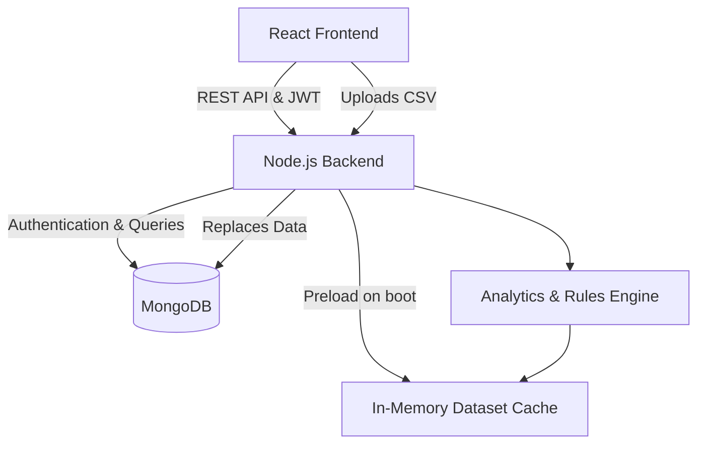

# HR Analytics Platform

   

## 📖 Project Description

The **HR Analytics Platform** is an AI-powered workforce intelligence dashboard designed to give human resources administrators and department managers deep, actionable insights into their organization. 

By analyzing comprehensive datasets encompassing demographics, performance, absenteeism, and engagement, the system seeks to proactively identify workforce trends before they become critical issues. 

**Target Users:**
* **HR Administrators**: Require high-level oversight across the entire company, access to granular AI recommendations, and the ability to upload and refresh master datasets.
* **Department Managers**: Require focused, scoped views limited strictly to their own department's data to monitor the health and performance of their direct reports.

**Main Goals:**
1. Provide a real-time, consolidated executive overview of company health (attrition, headcount, engagement).
2. Predict employee flight risk and performance trends using heuristic and ML-inspired models.
3. Automatically generate recommended HR actions (e.g., compensation reviews, retention discussions) for specific employees.
4. Uncover systemic organizational issues such as gender pay gaps or ineffective training programs.

---

## ✨ Features

### General System
* **Role-Based Access Control (RBAC)**: Secure routing and data scoping for HR and Manager roles.
* **Department Scoping**: Managers dynamically select their department upon login, and the backend data engine physically scopes all subsequent queries to that team.

### Module: Executive Overview
* Top-level KPIs: Total Headcount, Overall Attrition Rate, Avg Engagement, Avg Performance, and Critical Alerts.
* Headcount and Attrition rate visualizations organized by department.

### Module: Employee Directory
* Searchable, filterable (by department) grid of all employees.
* Clickable rows that open a detailed modal containing all available metrics for a specific employee.

### Module: Performance Analytics
* **Current Performance**: Visualize rating distributions and high-performer percentages.
* **Predicted Performance**: Forecasted performance bands based on historical metric correlations.
* **Behavioral Risk**: Assessment of burnout risk and engagement strain across departments.

### Module: Recommendations & Insights
* **Action Plans**: AI-generated priority lists (Immediate Action, Planned Action, Monitor) directing managers to intervene with specific employees.
* **Pay Equity**: Automated gender pay gap analysis across job roles and departments.
* **Training Impact**: Correlation mapping between training sessions attended, performance ratings, and engagement scores.

### Module: Risk & Alerts
* **Turnover & Retention**: Granular breakdown of attrition by department and tenure length.
* **Absenteeism**: Tracking of average absence days and high-absence flags.
* **System Alerts**: Automated rule-based alerts triggered by critical workforce metric deviations (e.g., sudden spikes in absenteeism).

### Module: Data Upload (HR Only)
* Drag-and-drop CSV upload portal.
* In-browser column validation ensuring required metrics exist.
* Live dataset preview before applying changes to the MongoDB backend.

---

## 🏗️ System Architecture

The project utilizes a modern decoupled architecture. 
* **Frontend**: A React Single Page Application (SPA) providing a dynamic, client-side routed dashboard.
* **Backend**: An Express.js REST API serving as the data engine. It handles authentication, data validation, dataset preloading (for fast memory-based analytics), and heuristic ML calculations.
* **Database**: MongoDB Atlas handles persistent storage for user credentials and the raw employee datasets.



---

## 💻 Technology Stack

### Frontend
* **Core**: React 19, Vite
* **Routing**: React Router DOM 7
* **Data Visualization**: Recharts 3
* **Networking**: Axios
* **Styling**: Vanilla CSS (CSS Variables, Flexbox/Grid, custom responsive components)

### Backend
* **Core**: Node.js, Express.js
* **Authentication**: JSON Web Tokens (jsonwebtoken), bcryptjs
* **Database Driver**: MongoDB Native Driver (`mongodb`)
* **File Uploads**: Multer
* **Data Processing**: `csv-parse`

### External / Scripts
* **Notebooks**: Python (Jupyter, Pandas, Scikit-learn) used in the `notebooks/` directory to derive the heuristic rules implemented in the Node.js backend.

---

## 📂 Project Structure

```text
C:\...\gp\
├── backend/                   # Node.js Express API
│   ├── index.js               # Application entry point & server setup
│   ├── seed.js                # Database initialization and user seeding script
│   ├── src/
│   │   ├── routes/            # Express route controllers (auth, dashboard, employees, etc.)
│   │   ├── services/          # Core business logic (dataService, metricsService, mlService)
│   │   ├── middleware/        # Express middleware (authMiddleware for JWT validation)
│   │   └── db.js              # MongoDB connection singleton
│   └── package.json           
├── frontend/                  # React Vite SPA
│   ├── index.html             # HTML entry
│   ├── vite.config.js         # Vite bundler configuration
│   ├── src/
│   │   ├── main.jsx           # React DOM render
│   │   ├── App.jsx            # React Router and Route protection logic
│   │   ├── index.css          # Global CSS design system and variables
│   │   ├── api/               # Axios client configuration (client.js)
│   │   ├── components/        # Reusable UI (Layout.jsx sidebar navigation)
│   │   ├── context/           # React Context (AuthContext.jsx for global user state)
│   │   └── pages/             # Main dashboard views (Overview, Employees, Performance...)
│   └── package.json           
├── data/                      # Raw datasets
│   └── raw/                   # CSV files (employee_ml_dataset_v3.csv, etc.)
└── notebooks/                 # Python Jupyter Notebooks for ML R&D
```

---

## 🗄️ Database Design

The application utilizes MongoDB with three primary collections:

| Collection Name | Purpose |
| :--- | :--- |
| `users` | Stores application user accounts, roles, and securely hashed passwords. |
| `employees` | The primary dataset driving the majority of the analytics (sourced from `employee_ml_dataset_v3.csv`). Contains highly detailed metrics like AbsenceDays, EngagementScore, BurnoutRiskScore. |
| `ibm_attrition` | A secondary dataset (sourced from `HR-Employee-Attrition.csv`) specifically leveraged for Pay Equity and Promotion Prediction algorithms. |

*Note: The application aggressively caches the `employees` and `ibm_attrition` collections in memory on the Node.js server (`dataService.js`) to provide highly responsive aggregate queries for the frontend dashboard.*

---

## 🔌 API Documentation

All endpoints are prefixed with `/api`. Unless noted, endpoints require a valid JWT Bearer token.

### Authentication (`/auth`)
* `POST /auth/login`: Authenticates a user.
  * **Body**: `{ "username": "hr", "password": "...", "department": "Sales" (optional) }`
  * **Response**: `{ "access_token": "...", "user": { "username": "hr", "role": "hr", "department": "Sales" } }`
* `GET /auth/departments`: Returns a list of distinct departments for the Manager login dropdown. (No auth required)

### Dashboard (`/dashboard`)
* `GET /dashboard/overview`: Returns top-level KPIs (headcount, attrition, avg scores).
* `GET /dashboard/departments`: Returns headcount and attrition aggregates broken down by department.
* `GET /dashboard/performance`: Returns current performance rating distributions.
* `GET /dashboard/turnover`: Returns granular turnover statistics.
* `GET /dashboard/absenteeism`: Returns absence statistics and distribution buckets.

### Employees (`/employees`)
* `GET /employees/`: Returns the paginated/filtered list of employees.
  * **Query Params**: `search` (string), `department` (string).
* `GET /employees/departments`: Returns distinct departments for filtering.

### Machine Learning & Predictions (`/predictions`)
* `GET /predictions/performance`: Returns forecasted performance bands.
* `GET /predictions/promotion`: Returns promotion readiness analysis.
* `GET /predictions/behavioral-risk`: Returns burnout and engagement strain analysis.

### Recommendations (`/recommendations`)
* `GET /recommendations/`: Returns AI-generated action plans mapped to specific employees.
* `GET /recommendations/pay-equity`: Returns gender pay gap analysis data.
* `GET /recommendations/training-impact`: Returns correlation data between training and performance.

### Alerts (`/alerts`)
* `GET /alerts/`: Returns an array of triggered system alerts (e.g., `{ id, type, severity, message, department }`).

### Data Upload (`/upload`) - *HR Role Only*
* `POST /upload/preview`: Accepts a `multipart/form-data` CSV file and returns validation results and a 10-row preview.
* `POST /upload/apply`: Accepts a `multipart/form-data` CSV file, validates it, drops the existing database collection, inserts the new data, and refreshes the in-memory cache.

---

## 🔐 User Roles & Permissions

The platform enforces strict Role-Based Access Control via `authMiddleware.js` on the backend and `RoleProtectedRoute` in the React frontend.

1. **HR Administrator (`hr`)**:
   * Has global visibility across the entire company.
   * Has exclusive access to the **Upload Data** module to manage the core CSV datasets.
2. **Department Manager (`manager`)**:
   * Must explicitly select their department from a dropdown during the login flow.
   * The selected department is cryptographically embedded in their JWT.
   * All API queries silently filter the in-memory dataset to *only* include employees within their department.
   * Denied access to the Data Upload module.

---

## 🚀 Installation Guide

### Prerequisites
* Node.js (v18 or higher)
* MongoDB (Local instance or Atlas URI)

### 1. Database Setup
Ensure MongoDB is running. The default local connection string is `mongodb://127.0.0.1:27017`.

### 2. Backend Setup
```bash
cd backend
npm install

# Create a .env file based on the Configuration section below
# (A default .env is already provided in the repository)

# Seed the database and load the initial CSV data
node seed.js

# Start the development server
npm run dev
```

### 3. Frontend Setup
```bash
cd frontend
npm install

# Start the Vite development server
npm run dev
```

### 4. Running the Project
Navigate to `http://localhost:5173`. 
You can log in using the seeded demo credentials:
* **HR Admin**: `hr` / `hr123`
* **Manager**: `manager` / `manager123` (Requires selecting a department)

---

## ⚙️ Configuration

Environment variables are located in `backend/.env`:

```env
MONGO_URI=mongodb://127.0.0.1:27017
DB_NAME=hr_analytics
JWT_SECRET=your_secure_random_string
JWT_EXPIRES_IN=8h
PORT=8000
```

*Note: The frontend expects the backend to be running on `http://localhost:8000/api`. This is configured in `frontend/src/api/client.js`.*

---

## 📖 User Guide

### Logging In
1. Navigate to the login page.
2. Enter your credentials.
3. If logging in as a `manager`, an additional dropdown will appear. You **must** select the department you wish to manage.
4. Click "Sign In".

### Navigating the System
The left-hand sidebar provides access to all modules you are authorized to view.
* **Executive Overview**: Your landing page. Check the top KPI cards for immediate system health. Look for red indicators (e.g., Attrition > 15%).
* **Employees**: Use the search bar to find specific personnel. Click on any row to open a modal detailing their specific metrics.
* **Recommendations**: Switch between the tabs at the top to view Action Plans, Pay Equity analyses, and Training Impact data.
* **Upload Data (HR Only)**: Drag and drop a new CSV file into the dropzone. Review the column validation to ensure the schema is correct, then click "Upload & Apply".

---

## 🛡️ Security

* **Authentication**: Stateless JSON Web Tokens (JWT) stored in `localStorage`.
* **Password Storage**: Passwords are one-way hashed using `bcryptjs` with a 10-round salt before being stored in MongoDB.
* **Authorization**: The Express API utilizes custom middleware (`requireRole`) to block unauthorized HTTP requests at the route level.
* **Data Isolation**: Department-level data scoping is enforced at the lowest service layer (`dataService.js`). The scoping variable is extracted securely from the signed JWT payload, preventing users from spoofing department access.

---

## 🛠️ Development Guide

### Adding New Features
1. **Backend**: 
   * Add new data logic to the appropriate service in `backend/src/services/`.
   * Expose the data via a route controller in `backend/src/routes/`.
   * Mount the route in `backend/index.js`.
2. **Frontend**:
   * Create a new React component in `frontend/src/pages/`.
   * Fetch the data using the Axios instance in `api/client.js`.
   * Add a new `<Route>` mapping in `frontend/src/App.jsx`.
   * Add a new navigation entry to the `NAV` array in `frontend/src/components/Layout.jsx`.

### Coding Standards
* Use ES Modules (`import`/`export`) for both frontend and backend code.
* Use React Hooks and functional components.
* Maintain the aesthetic constraints of the application by utilizing the CSS Variables defined in `index.css`.

---

## 🧪 Testing

*Not found in the codebase.*
Currently, there are no automated test suites (e.g., Jest, Cypress) configured for this project. 

---

## 🚀 Deployment

The project is ready for containerization or standard PaaS deployment.

**Backend Deployment:**
1. Set the `MONGO_URI` to a production MongoDB Atlas cluster.
2. Set a strong `JWT_SECRET`.
3. Run using `npm start` (which executes `node index.js`).

**Frontend Deployment:**
1. Update `baseURL` in `frontend/src/api/client.js` to point to your production backend domain.
2. Run `npm run build`.
3. Serve the contents of the `frontend/dist/` directory using Nginx, Vercel, Netlify, or any static file host. Ensure that all 404s route back to `index.html` to support React Router SPA behavior.

---

## 🔮 Future Improvements

1. **Database Pagination**: Currently, the backend caches datasets in memory and returns large arrays. For enterprise-scale datasets (100k+ rows), MongoDB-level pagination (`.skip()`, `.limit()`) should be implemented in `dataService.js`.
2. **Python ML Microservice**: The predictive logic in `mlService.js` is currently heuristic/rule-based, adapted from the Jupyter Notebooks. A future iteration should expose the actual Scikit-learn models via a FastAPI Python microservice.
3. **Automated Testing**: Introduce Jest for backend API testing and React Testing Library for frontend component verification.
4. **Export to PDF/CSV**: Allow managers to export the generated Action Plans and KPI charts for external reporting.

---

## 📄 License

*Not found in the codebase.*
This project currently operates without a specified open-source license.
